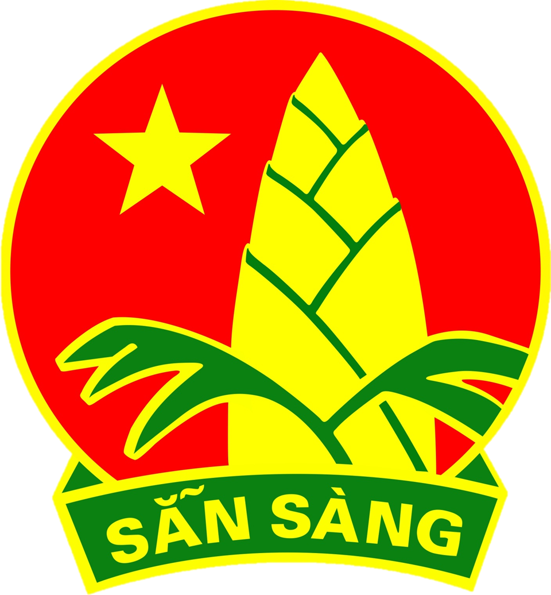
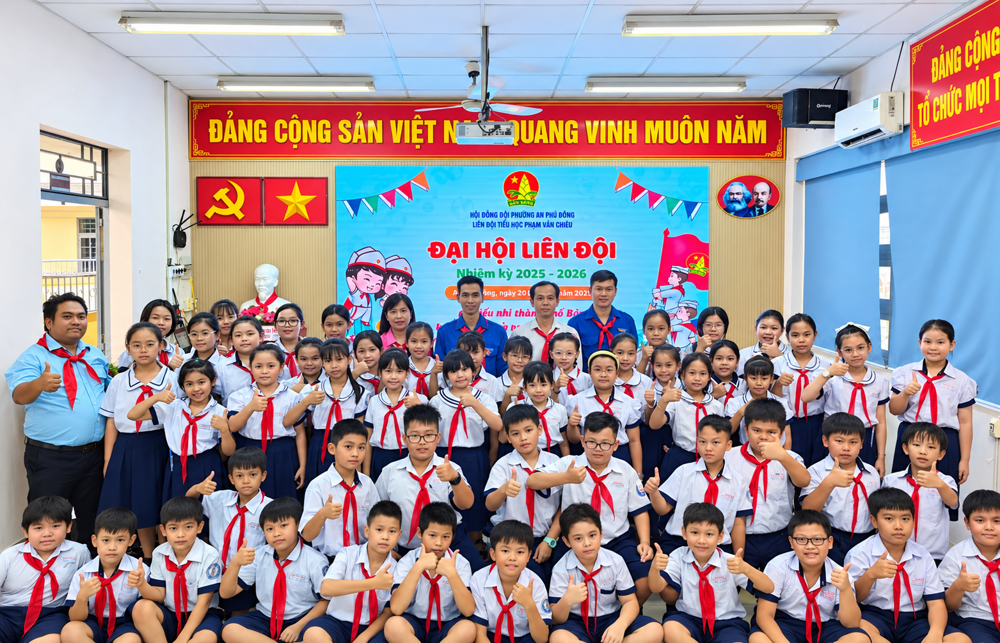

CỔNG THÔNG TIN LIÊN ĐỘI

<h1>Trường Tiểu học Phạm Văn Chiêu</h1>

Không gian thông tin, tài liệu và hoạt động phục vụ công tác Đội và phong trào thiếu nhi trong nhà trường.

<a href="#/hoat-dong-phong-trao" class="btn-primary">Khám phá hoạt động</a><a href="#/cam-nang-nghiep-vu" class="btn-secondary">Cẩm nang nghiệp vụ</a>

## Giới thiệu

**Cổng thông tin Liên đội Trường Tiểu học Phạm Văn Chiêu** được xây dựng nhằm tập hợp, hệ thống hóa và chia sẻ các thông tin, tài liệu phục vụ công tác Đội và phong trào thiếu nhi trong nhà trường.

Thông qua Cổng thông tin, học sinh, giáo viên, Ban Chỉ huy Liên đội và các thành viên tham gia công tác Đội có thể thuận tiện tra cứu nội dung, tìm hiểu hoạt động, tham khảo tài liệu nghiệp vụ và gửi ý kiến phản hồi.

> **Mục tiêu:** Xây dựng một không gian thông tin số tập trung, dễ tra cứu, thuận tiện cập nhật và có khả năng tiếp tục mở rộng trong quá trình sử dụng.

---

<h2>Các chuyên mục chính</h2>

<a href="#/gioi-thieu" class="portal-card">

01

<h3>Giới thiệu Liên đội</h3>

Thông tin chung, nhiệm vụ và định hướng hoạt động của Liên đội.

</a>
<a href="#/hoat-dong-phong-trao" class="portal-card">

02

<h3>Hoạt động - Phong trào</h3>

Theo dõi các chương trình, phong trào và hoạt động tiêu biểu của Liên đội.

</a>
<a href="#/cam-nang-nghiep-vu" class="portal-card">

03

<h3>Cẩm nang nghiệp vụ Đội</h3>

Tra cứu hướng dẫn, quy trình và tài liệu hỗ trợ công tác Đội.

</a>
<a href="#/lien-he-gop-y" class="portal-card">

04

<h3>Liên hệ - Góp ý</h3>

Gửi ý kiến, đề xuất và phản hồi đến Liên đội thông qua biểu mẫu trực tuyến.

</a>

---

## Hoạt động Liên đội

> Cổng thông tin từng bước cập nhật các hoạt động, phong trào và nội dung phục vụ công tác Đội trong nhà trường.

---

## Mục tiêu của Cổng thông tin

Cổng thông tin được xây dựng với các mục tiêu:

- Tập trung thông tin và tài liệu phục vụ công tác Liên đội.
- Hỗ trợ tra cứu tài liệu nhanh chóng và thuận tiện.
- Giới thiệu các hoạt động, phong trào tiêu biểu.
- Hỗ trợ giáo viên và học sinh tiếp cận các nội dung nghiệp vụ Đội.
- Tạo kênh tiếp nhận ý kiến và phản hồi trực tuyến.
- Từng bước ứng dụng công nghệ số vào công tác Đội trong nhà trường.

---

## Đối tượng sử dụng

| Đối tượng | Nhu cầu sử dụng |
|---|---|
| **Học sinh** | Tìm hiểu hoạt động, phong trào và các nội dung về Đội |
| **Ban Chỉ huy Liên đội** | Tham khảo hướng dẫn, tài liệu và nội dung phục vụ hoạt động |
| **Giáo viên** | Tra cứu thông tin và tài liệu hỗ trợ công tác Đội |
| **Tổng phụ trách Đội** | Hệ thống hóa, cập nhật và chia sẻ thông tin nghiệp vụ |

---

## Cách sử dụng

Bạn có thể:

- Sử dụng **menu bên trái** để truy cập các chuyên mục.
- Sử dụng **ô tìm kiếm** để tìm nhanh nội dung cần thiết.
- Sử dụng nút **sáng / tối** ở góc dưới bên phải để thay đổi giao diện.
- Sử dụng chức năng **Copy Code** tại các khối mã trong Cẩm nang nghiệp vụ.
- Gửi ý kiến trực tiếp thông qua biểu mẫu tại chuyên mục **Liên hệ - Góp ý**.

---

## Thông tin dự án

| Nội dung | Thông tin |
|---|---|
| **Tên dự án** | Cổng thông tin Liên đội Trường Tiểu học Phạm Văn Chiêu |
| **Nền tảng** | Docsify |
| **Xuất bản** | GitHub Pages |
| **Định dạng nội dung** | Markdown |
| **Quản lý mã nguồn** | GitHub |
| **Tích hợp** | Google Forms |
| **Năm thực hiện** | 2026 |

> Cổng thông tin được xây dựng và hoàn thiện từng bước trong quá trình thực hiện đồ án Nhập môn Công nghệ thông tin.
